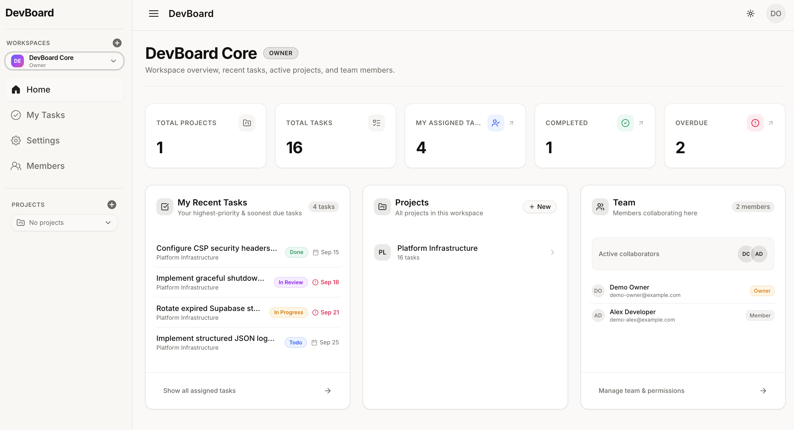
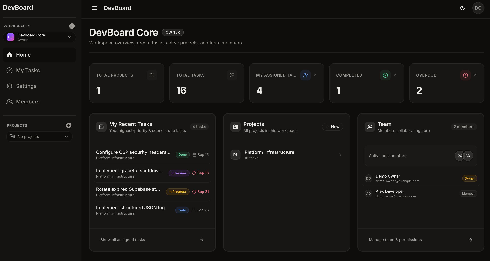
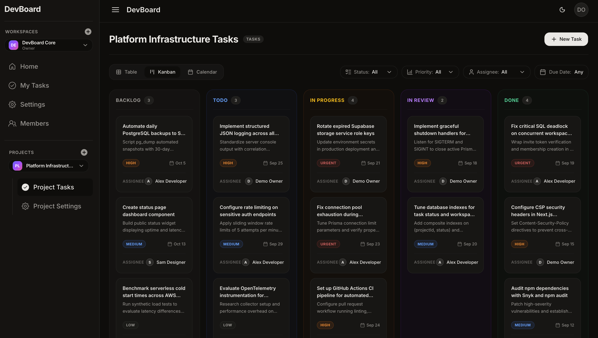
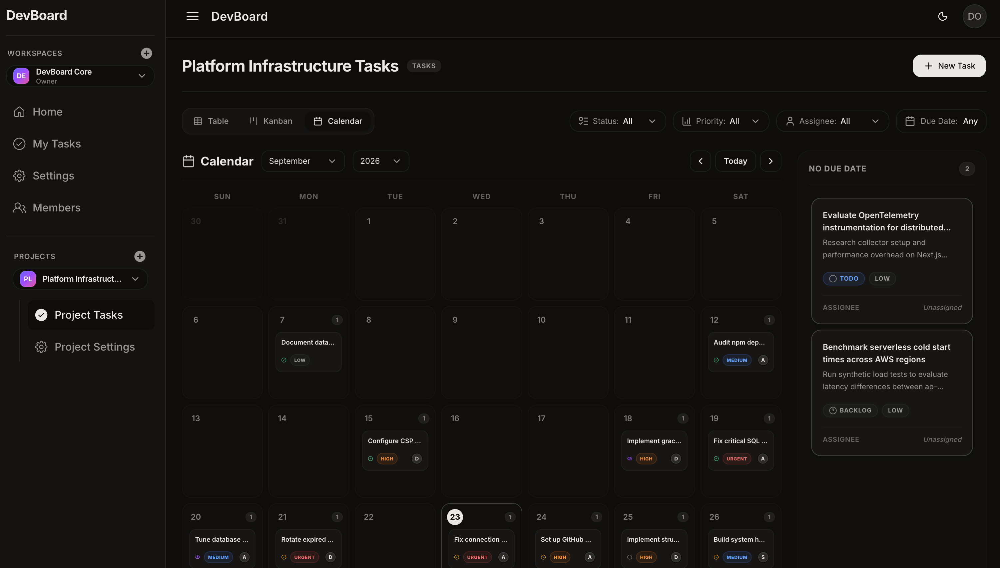
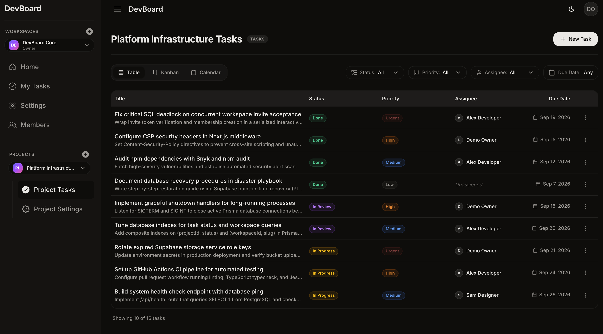
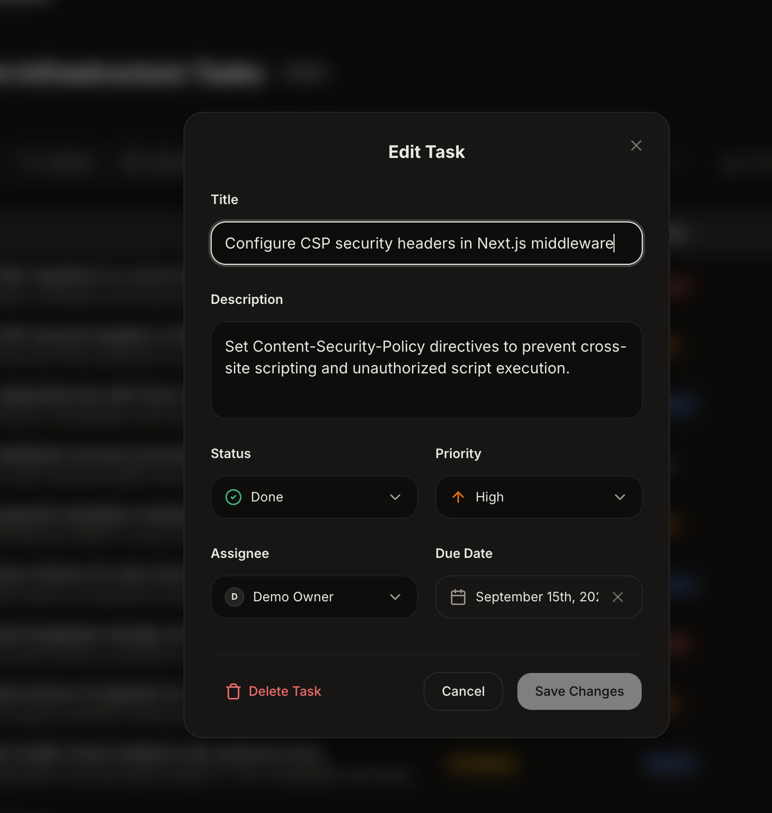
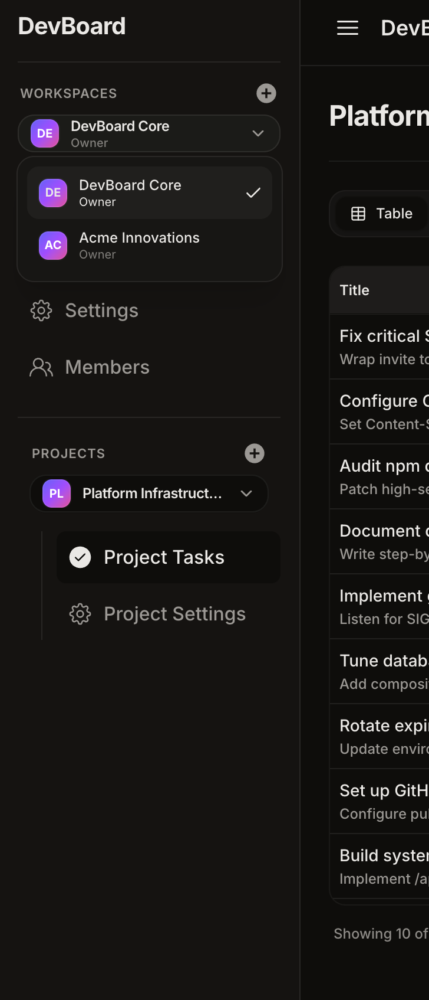
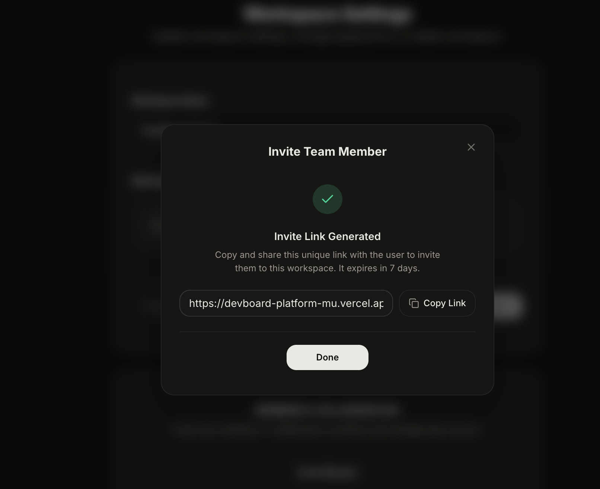
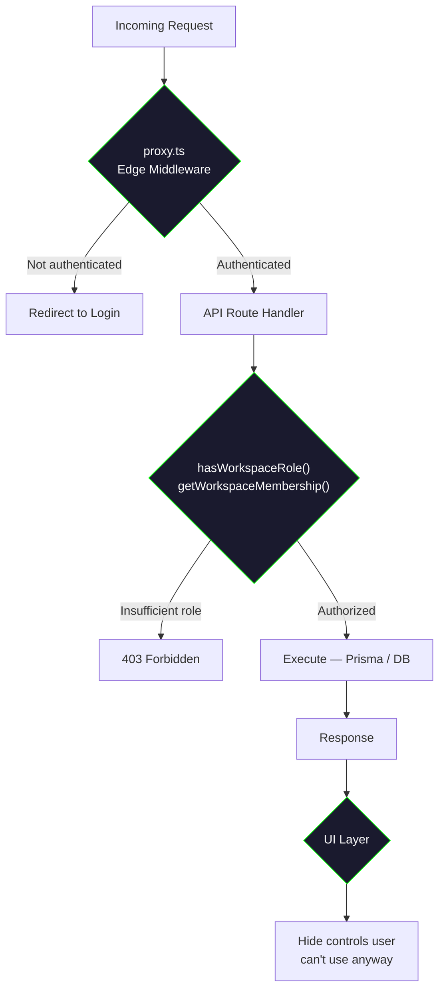
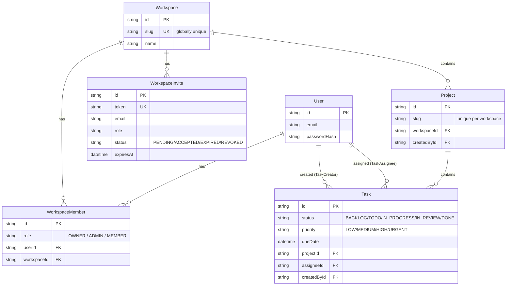

<div align="center">

# DevBoard

**A multi-tenant project management platform** — Workspace → Project → Task, built with Next.js 16, TypeScript, and Prisma/PostgreSQL.

[Live Demo](https://devboard-platform-mu.vercel.app/) · [Report a Bug](../../issues) · [Request a Feature](../../issues)

   



</div>

## Table of Contents

- [Overview](#overview)
- [Features](#features)
- [Screenshots](#screenshots)
- [Tech Stack](#tech-stack)
- [Architecture](#architecture)
- [Database Schema](#database-schema)
- [Folder Structure](#folder-structure)
- [Getting Started](#getting-started)
- [Testing](#testing)
- [Architectural Decisions](#architectural-decisions)
- [Known Limitations / Roadmap](#known-limitations--roadmap)
- [Branching & Commit Conventions](#branching--commit-conventions)
- [License](#license)

## Overview

DevBoard is a full-stack project management platform in the spirit of Linear/Asana — teams organize work into **Workspaces**, each containing multiple **Projects**, each containing **Tasks**. It supports role-based permissions, shareable invite links, and three interchangeable task views (Table, Kanban, Calendar) backed by a single shared data layer.

Built solo as a deep-dive into production-grade full-stack patterns: multi-tenant data modeling, layered authorization, and the operational realities of shipping to Vercel — not just making features work, but making the right trade-offs on how they work.

## Features

**Auth & Access**

- Credentials-based auth (bcrypt + JWT sessions via NextAuth v5)
- Role-based permissions: `OWNER` / `ADMIN` / `MEMBER`
- Three-layer defense-in-depth authorization (middleware → API → UI)

**Workspaces & Projects**

- Create/edit/delete with logo upload (client-side compressed)
- Shareable invite links (7-day expiry) with full edge-case handling
- Workspace-scoped project slugs

**Tasks**

- Full CRUD with role-gated edit/delete permissions
- Three unified views — **Table** (cursor pagination + infinite scroll), **Kanban** (drag to change status), **Calendar** (drag to reschedule)
- Cross-project **My Tasks** view scoped to the active workspace

**Polish**

- Dark mode (`next-themes`), softened light theme for reduced eye strain
- Reusable dialog primitives (`FormDialog`, `ConfirmDialog`) used across every create/edit/delete flow
- Workspace home page with live stats (overdue, completed, assigned)

## Screenshots

<table>
<tr>
<td width="50%"><b>Dashboard — Light</b><br></td>
<td width="50%"><b>Dashboard — Dark</b><br></td>
</tr>
<tr>
<td width="50%"><b>Kanban — drag to change status</b><br></td>
<td width="50%"><b>Calendar — drag to reschedule</b><br></td>
</tr>
<tr>
<td width="50%"><b>Table — cursor pagination</b><br></td>
<td width="50%"><b>Task editing</b><br></td>
</tr>
<tr>
<td width="50%"><b>Multi-workspace switcher</b><br></td>
<td width="50%"><b>Invite link generation</b><br></td>
</tr>
</table>

## Tech Stack

| Layer        | Choice                              | Why                                                                                |
| ------------ | ----------------------------------- | ---------------------------------------------------------------------------------- |
| Framework    | Next.js 16 (App Router), TypeScript | Server components + file-based routing; type safety across the stack               |
| Styling      | Tailwind CSS + shadcn/ui            | Utility-first styling with accessible, composable primitives                       |
| Database     | PostgreSQL via Supabase             | Managed Postgres with built-in storage for logo uploads                            |
| ORM          | Prisma 6                            | Type-safe queries; pinned to v6 to avoid the v7 adapter-config rewrite mid-project |
| Auth         | NextAuth v5 (Credentials, JWT)      | Credentials provider hard-requires JWT sessions — not a preference, a constraint   |
| Server State | TanStack React Query                | Caching, refetching, and optimistic updates for all server data                    |
| Forms        | React Hook Form + Zod               | Schema-validated forms with minimal re-renders                                     |
| Drag & Drop  | @dnd-kit/core                       | Single integration reused across Kanban and Calendar                               |
| Testing      | Jest + React Testing Library        | Coverage on core workflows                                                         |
| Hosting      | Vercel                              | Git-push deploys; production database seeded via a guarded manual script           |

**No global state library** — server data lives in React Query's cache, auth session in NextAuth's `SessionProvider`, navigation state in the URL (`/dashboard/[workspaceSlug]/projects/[projectSlug]`), and UI toggles in local `useState`. Each concern already had a purpose-built tool, so nothing needed a general-purpose store.

## Architecture

**Defense-in-depth authorization** — no single layer is solely responsible for access control:



**Auth runtime split** — `auth.config.ts` (edge-safe, no Prisma) powers `proxy.ts`; `auth.ts` (full Credentials + PrismaAdapter config) runs in the Node runtime, since Prisma isn't edge-compatible.

**Logo uploads** go through a server-side route (`/api/workspaces/upload-logo`) using Supabase's `service_role` key, rather than direct browser-to-Storage with RLS — because auth here is NextAuth, not Supabase Auth, so RLS policies checking `to authenticated` never recognize these sessions at all.

## Database Schema



Full schema lives in [`prisma/schema.prisma`](prisma/schema.prisma). Notable decisions:

- `WorkspaceMember` was built as a join table with roles from day one — before roles were strictly needed — to avoid a painful later migration
- `Workspace.slug` is globally unique; `Project.slug` is unique only within its workspace (`@@unique([workspaceId, slug])`)
- `createdById` is tracked explicitly on `Project` and `Task` for accountability, mirroring `WorkspaceInvite.invitedById`

## Folder Structure

```
src/
├── app/                    # Next.js App Router — pages & API routes
│   ├── api/                #   REST endpoints (auth, workspaces, tasks...)
│   └── dashboard/[workspaceSlug]/projects/[projectSlug]/  # active nav state lives in the URL
├── components/             # Reusable UI (shadcn/ui-based) + FormDialog/ConfirmDialog primitives
├── lib/                    # Auth helpers (workspace-auth.ts), Prisma client, Supabase admin client
├── hooks/                  # Shared React Query hooks (used by Table/Kanban/Calendar alike)
└── types/                  # Shared TypeScript types

prisma/
├── schema.prisma
└── seed.ts                 # Manual, confirmation-gated — prevents seeding the wrong environment
```

<details>
<summary>Full tree (click to expand)</summary>

```
.
├── prisma/
│   ├── schema.prisma
│   └── seed.ts
├── src/
│   ├── app/
│   │   ├── api/
│   │   │   ├── auth/[...nextauth]/route.ts
│   │   │   └── workspaces/upload-logo/route.ts
│   │   └── dashboard/[workspaceSlug]/projects/[projectSlug]/
│   ├── components/
│   ├── lib/
│   │   ├── workspace-auth.ts
│   │   ├── supabase-admin.ts
│   │   ├── auth.config.ts
│   │   └── auth.ts
│   ├── hooks/
│   └── types/
├── proxy.ts
└── package.json
```

</details>

## Getting Started

**Prerequisites:** Node.js 20+, a Supabase project (Postgres + Storage)

```bash
git clone https://github.com/gurjung/devboard-platform.git
cd devboard-platform
npm install
```

Create `.env.local`:

```env
DATABASE_URL=postgresql://...
AUTH_SECRET=...
NEXT_PUBLIC_SUPABASE_URL=...
SUPABASE_SERVICE_ROLE_KEY=...
```

```bash
npx prisma migrate dev
npx prisma db seed     # prompts for confirmation before seeding
npm run dev
```

## Testing

```bash
npm run test
```

Jest + React Testing Library cover core workflows — auth, permission checks, and task CRUD flows.

## Architectural Decisions

<details>
<summary><b>Why no global state library</b></summary>
<br>
Every kind of state already had a specialized owner: server data → React Query cache, auth session → NextAuth's SessionProvider, navigation → the URL, UI toggles → local state. A general-purpose store (Redux/Zustand) would have added indirection without solving a problem that existed.
</details>

<details>
<summary><b>Why cursor-based pagination everywhere</b></summary>
<br>
Applied consistently across the Table, Kanban/Calendar data fetch, and My Tasks — rather than mixing in offset pagination for any one view — even though numbered pagination was considered for My Tasks specifically. Consistency won over micro-optimizing one view.
</details>

<details>
<summary><b>Why Kanban has no manual reordering, but Calendar has drag-to-reschedule</b></summary>
<br>
Calendar drag-and-drop reused the @dnd-kit integration already built for Kanban with minimal new complexity. In-column Kanban reordering would have needed a new <code>order</code> field plus tie-breaking logic — deferred as genuinely new schema/logic rather than a natural extension.
</details>

<details>
<summary><b>Why invite acceptance uses a database transaction</b></summary>
<br>
Accepting an invite creates a <code>WorkspaceMember</code> row <i>and</i> updates the invite's status to <code>ACCEPTED</code>. Both are wrapped in a single <code>$transaction</code> so they succeed or roll back together — avoiding a state where a member exists but the invite still shows pending.
</details>

## Known Limitations / Roadmap

- [ ] **Forgot / reset password** — highest priority; no account-recovery path currently exists
- [ ] Change password while logged in
- [ ] Self-service "leave workspace" for members
- [ ] Text search over tasks/projects
- [ ] OAuth providers (Google/GitHub) — `PrismaAdapter` has been ready since day one, never wired up
- [ ] Pagination on workspace/project/member list endpoints
- [ ] Task comments
- [ ] Rate limiting

## Branching & Commit Conventions

```
feature/<short-description>
```

Conventional commits, with bullet points in the body for larger changes:

```
feat(tasks): add cursor-based pagination to task table

- Replace offset pagination with cursor-based approach
- Add infinite scroll trigger on table view
```

## License

MIT
